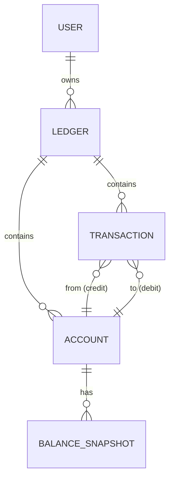

# Data Model: LedgerOne Core Accounting System

**Date**: 2026-01-02 (Updated from 2025-11-22)
**Feature**: Core Accounting System
**Source**: [spec.md](./spec.md)

This document defines the core data entities for the accounting system using PostgreSQL with SQLModel ORM.

## Entity Relationship Diagram (ERD)



## Entity Definitions

### 1. User

Represents a unique user of the application.

- **Source**: Future auth feature (simplified for MVP)
- **Description**: A unique user identity. MVP assumes single-user; full auth in future feature.

| Field        | Type         | Description          | Constraints               |
| :----------- | :----------- | :------------------- | :------------------------ |
| `id`         | UUID         | Primary Key          | DEFAULT gen_random_uuid() |
| `email`      | VARCHAR(255) | User email           | NOT NULL, UNIQUE          |
| `created_at` | TIMESTAMPTZ  | Record creation time | NOT NULL, DEFAULT NOW()   |

**SQLModel Definition**:

```python
class User(SQLModel, table=True):
    __tablename__ = "users"

    id: uuid.UUID = Field(default_factory=uuid.uuid4, primary_key=True)
    email: str = Field(max_length=255, unique=True, index=True)
    created_at: datetime = Field(default_factory=lambda: datetime.now(timezone.utc))
```

---

### 2. Ledger

A container for a complete set of financial records (an account book).

- **Source**: `spec.md` -> `Database Schema` -> `ledgers`
- **Description**: Represents a specific tracking context (e.g., personal finances for 2024). Each ledger has an independent chart of accounts and transaction list.

| Field             | Type          | Description            | Constraints               |
| :---------------- | :------------ | :--------------------- | :------------------------ |
| `id`              | UUID          | Primary Key            | DEFAULT gen_random_uuid() |
| `user_id`         | UUID          | Foreign Key to `users` | NOT NULL                  |
| `name`            | VARCHAR(100)  | Name of the ledger     | NOT NULL                  |
| `initial_balance` | NUMERIC(15,2) | Initial cash balance   | NOT NULL, DEFAULT 0       |
| `created_at`      | TIMESTAMPTZ   | Record creation time   | NOT NULL, DEFAULT NOW()   |

**SQLModel Definition**:

```python
class Ledger(SQLModel, table=True):
    __tablename__ = "ledgers"

    id: uuid.UUID = Field(default_factory=uuid.uuid4, primary_key=True)
    user_id: uuid.UUID = Field(foreign_key="users.id", index=True)
    name: str = Field(max_length=100)
    initial_balance: Decimal = Field(default=Decimal("0"), max_digits=15, decimal_places=2)
    created_at: datetime = Field(default_factory=lambda: datetime.now(timezone.utc))

    # Relationships
    accounts: list["Account"] = Relationship(back_populates="ledger")
    transactions: list["Transaction"] = Relationship(back_populates="ledger")
```

---

### 3. Account

A single category within the Chart of Accounts for a ledger.

- **Source**: `spec.md` -> `Database Schema` -> `accounts`
- **Description**: A classification category (Asset, Liability, Income, Expense).

| Field        | Type          | Description                  | Constraints                                         |
| :----------- | :------------ | :--------------------------- | :-------------------------------------------------- |
| `id`         | UUID          | Primary Key                  | DEFAULT gen_random_uuid()                           |
| `ledger_id`  | UUID          | Foreign Key to `ledgers`     | NOT NULL                                            |
| `name`       | VARCHAR(100)  | Account name                 | NOT NULL                                            |
| `type`       | ENUM          | Account type                 | NOT NULL, one of: ASSET, LIABILITY, INCOME, EXPENSE |
| `balance`    | NUMERIC(15,2) | Cached balance               | NOT NULL, DEFAULT 0                                 |
| `is_system`  | BOOLEAN       | True for predefined accounts | NOT NULL, DEFAULT FALSE                             |
| `created_at` | TIMESTAMPTZ   | Record creation time         | NOT NULL, DEFAULT NOW()                             |
| `updated_at` | TIMESTAMPTZ   | Last modification time       | NOT NULL, DEFAULT NOW()                             |

**SQLModel Definition**:

```python
class AccountType(str, Enum):
    ASSET = "ASSET"
    LIABILITY = "LIABILITY"
    INCOME = "INCOME"
    EXPENSE = "EXPENSE"

class Account(SQLModel, table=True):
    __tablename__ = "accounts"

    id: uuid.UUID = Field(default_factory=uuid.uuid4, primary_key=True)
    ledger_id: uuid.UUID = Field(foreign_key="ledgers.id", index=True)
    name: str = Field(max_length=100)
    type: AccountType = Field(sa_column=Column(SAEnum(AccountType)))
    balance: Decimal = Field(default=Decimal("0"), max_digits=15, decimal_places=2)
    is_system: bool = Field(default=False)
    created_at: datetime = Field(default_factory=lambda: datetime.now(timezone.utc))
    updated_at: datetime = Field(default_factory=lambda: datetime.now(timezone.utc))

    # Relationships
    ledger: Ledger = Relationship(back_populates="accounts")
```

**Note**: The `balance` field is a cached value for performance. It MUST be recalculated from transactions after any CRUD operation to ensure accuracy (DI-005).

---

### 4. Transaction

A single financial event recorded using double-entry bookkeeping.

- **Source**: `spec.md` -> `Database Schema` -> `transactions`
- **Description**: An event affecting exactly two accounts with equal amounts.

| Field              | Type          | Description                  | Constraints                                 |
| :----------------- | :------------ | :--------------------------- | :------------------------------------------ |
| `id`               | UUID          | Primary Key                  | DEFAULT gen_random_uuid()                   |
| `ledger_id`        | UUID          | Foreign Key to `ledgers`     | NOT NULL                                    |
| `date`             | DATE          | Business date of transaction | NOT NULL                                    |
| `description`      | VARCHAR(255)  | User-provided description    | NOT NULL                                    |
| `amount`           | NUMERIC(15,2) | Transaction amount           | NOT NULL, > 0                               |
| `from_account_id`  | UUID          | Source account (Credit)      | NOT NULL, FK to accounts                    |
| `to_account_id`    | UUID          | Destination account (Debit)  | NOT NULL, FK to accounts                    |
| `transaction_type` | ENUM          | Transaction type             | NOT NULL, one of: EXPENSE, INCOME, TRANSFER |
| `created_at`       | TIMESTAMPTZ   | Record creation time         | NOT NULL, DEFAULT NOW()                     |
| `updated_at`       | TIMESTAMPTZ   | Last modification time       | NOT NULL, DEFAULT NOW()                     |

**SQLModel Definition**:

```python
class TransactionType(str, Enum):
    EXPENSE = "EXPENSE"
    INCOME = "INCOME"
    TRANSFER = "TRANSFER"

class Transaction(SQLModel, table=True):
    __tablename__ = "transactions"

    id: uuid.UUID = Field(default_factory=uuid.uuid4, primary_key=True)
    ledger_id: uuid.UUID = Field(foreign_key="ledgers.id", index=True)
    date: date = Field(index=True)
    description: str = Field(max_length=255)
    amount: Decimal = Field(max_digits=15, decimal_places=2, gt=0)
    from_account_id: uuid.UUID = Field(foreign_key="accounts.id", index=True)
    to_account_id: uuid.UUID = Field(foreign_key="accounts.id", index=True)
    transaction_type: TransactionType = Field(sa_column=Column(SAEnum(TransactionType)))
    created_at: datetime = Field(default_factory=lambda: datetime.now(timezone.utc))
    updated_at: datetime = Field(default_factory=lambda: datetime.now(timezone.utc))

    # Relationships
    ledger: Ledger = Relationship(back_populates="transactions")
    from_account: Account = Relationship(
        sa_relationship_kwargs={"foreign_keys": "[Transaction.from_account_id]"}
    )
    to_account: Account = Relationship(
        sa_relationship_kwargs={"foreign_keys": "[Transaction.to_account_id]"}
    )
```

**Validation Rules**:

- `from_account_id` != `to_account_id` (cannot transfer to same account)
- `amount` > 0 (always positive; direction determined by from/to)
- Transaction type must match account types:
  - EXPENSE: from Asset/Liability → to Expense
  - INCOME: from Income → to Asset/Liability
  - TRANSFER: from Asset/Liability → to Asset/Liability

---

### 5. Balance Snapshot (For Future Analytics)

Periodic snapshots of account balances for growth analysis.

- **Source**: `spec.md` -> `Database Schema` -> `balance_snapshots`
- **Description**: Monthly snapshots for CAGR calculation in 002-dashboard feature.

| Field        | Type          | Description               | Constraints               |
| :----------- | :------------ | :------------------------ | :------------------------ |
| `id`         | UUID          | Primary Key               | DEFAULT gen_random_uuid() |
| `date`       | DATE          | Snapshot date (month-end) | NOT NULL                  |
| `account_id` | UUID          | Foreign Key to `accounts` | NOT NULL                  |
| `amount`     | NUMERIC(15,2) | Balance at snapshot time  | NOT NULL                  |

**SQLModel Definition**:

```python
class BalanceSnapshot(SQLModel, table=True):
    __tablename__ = "balance_snapshots"

    id: uuid.UUID = Field(default_factory=uuid.uuid4, primary_key=True)
    date: date = Field(index=True)
    account_id: uuid.UUID = Field(foreign_key="accounts.id", index=True)
    amount: Decimal = Field(max_digits=15, decimal_places=2)
```

---

## Database Indexes

```sql
-- Performance indexes
CREATE INDEX idx_transactions_ledger_date ON transactions(ledger_id, date DESC);
CREATE INDEX idx_transactions_from_account ON transactions(from_account_id);
CREATE INDEX idx_transactions_to_account ON transactions(to_account_id);
CREATE INDEX idx_accounts_ledger ON accounts(ledger_id);
CREATE INDEX idx_balance_snapshots_account_date ON balance_snapshots(account_id, date DESC);
```

---

## Balance Calculation Logic

```python
def calculate_account_balance(account_id: UUID, session: Session) -> Decimal:
    """
    Calculate account balance from transactions.

    For Asset/Liability: SUM(incoming) - SUM(outgoing)
    For Income: SUM(outgoing)  # Money flows OUT to assets
    For Expense: SUM(incoming) # Money flows IN from assets
    """
    account = session.get(Account, account_id)

    # Sum of transactions where this account is the destination (debit/incoming)
    incoming = session.exec(
        select(func.coalesce(func.sum(Transaction.amount), 0))
        .where(Transaction.to_account_id == account_id)
    ).one()

    # Sum of transactions where this account is the source (credit/outgoing)
    outgoing = session.exec(
        select(func.coalesce(func.sum(Transaction.amount), 0))
        .where(Transaction.from_account_id == account_id)
    ).one()

    if account.type in (AccountType.ASSET, AccountType.LIABILITY):
        return incoming - outgoing
    elif account.type == AccountType.INCOME:
        return outgoing  # Income "earns" by sending to assets
    else:  # EXPENSE
        return incoming  # Expense "spends" by receiving from assets
```

---

## Predefined Accounts

When creating a new ledger, these system accounts are automatically created:

| Name   | Type  | is_system | Notes                                       |
| :----- | :---- | :-------- | :------------------------------------------ |
| Cash   | ASSET | TRUE      | Initial balance from ledger.initial_balance |
| Equity | ASSET | TRUE      | Opening balance offset account              |

These accounts cannot be deleted (FR-004).
