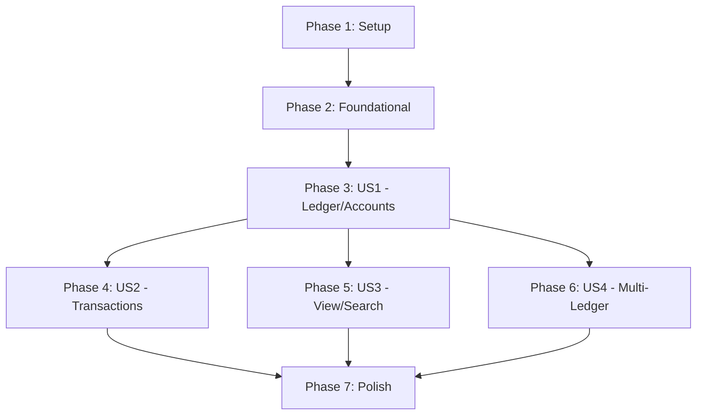

# Tasks: LedgerOne Core Accounting System

**Input**: Design documents from `/docs/features/001-core-accounting/`
**Prerequisites**: plan.md (required), spec.md (required), research.md, data-model.md, contracts/

**Tests**: Per MyAB Constitution Principle II (Test-First Development), tests are MANDATORY and MUST be written BEFORE implementation. Tests must be reviewed/approved before coding begins.

**Organization**: Tasks are grouped by user story to enable independent implementation and testing of each story.

## Format: `[ID] [P?] [Story] Description`

- **[P]**: Can run in parallel (different files, no dependencies)
- **[Story]**: Which user story this task belongs to (e.g., US1, US2, US3, US4)
- Include exact file paths in descriptions

## Path Conventions

This is a **web application** with frontend/backend separation:

- **Backend**: `backend/src/`, `backend/tests/`
- **Frontend**: `frontend/src/`, `frontend/tests/`

---

## Phase 1: Setup (Shared Infrastructure) ✅

**Purpose**: Project initialization and basic structure for Next.js + FastAPI + PostgreSQL

- [x] T001 Create project directory structure per plan.md (backend/, frontend/, docker-compose.yml)
- [x] T002 [P] Initialize backend Python project with pyproject.toml (FastAPI, SQLModel, uvicorn, alembic, pytest)
- [x] T003 [P] Initialize frontend Next.js 15 project with package.json (React 19, TypeScript, Tailwind, ShadcnUI)
- [x] T004 [P] Create docker-compose.yml with PostgreSQL 16, backend, and frontend services
- [x] T005 [P] Configure backend linting (ruff) and formatting in backend/pyproject.toml
- [x] T006 [P] Configure frontend linting (eslint) and formatting (prettier) in frontend/
- [x] T007 Create backend/.env.example and frontend/.env.example with required variables
- [x] T008 [P] Setup pytest configuration in backend/pyproject.toml
- [x] T009 [P] Setup Vitest configuration in frontend/vitest.config.ts

---

## Phase 2: Foundational (Blocking Prerequisites) ✅

**Purpose**: Core infrastructure that MUST be complete before ANY user story can be implemented

**⚠️ CRITICAL**: No user story work can begin until this phase is complete

### Backend Foundation

- [x] T010 Create backend/src/core/config.py with environment configuration (DATABASE_URL, etc.)
- [x] T011 Create backend/src/core/exceptions.py with custom exception classes
- [x] T012 Create backend/src/db/**init**.py and backend/src/db/session.py with database session management
- [x] T013 Setup Alembic for migrations in backend/ (alembic.ini, alembic/env.py)
- [x] T014 Create backend/src/api/**init**.py and backend/src/api/main.py with FastAPI app entry
- [x] T015 Create backend/src/api/deps.py with dependency injection (get_db, get_current_user)
- [x] T016 [P] Create backend/src/models/**init**.py
- [x] T017 [P] Create User model in backend/src/models/user.py per data-model.md
- [x] T018 Create initial Alembic migration for users table
- [x] T019 Create backend/src/api/routes/**init**.py with router registration

### Frontend Foundation

- [x] T020 [P] Create frontend/src/lib/api.ts with API client (fetch wrapper, error handling)
- [x] T021 [P] Create frontend/src/types/index.ts with TypeScript types matching backend models
- [x] T022 [P] Create frontend/src/app/layout.tsx with base layout (TanStack Query provider, theme)
- [x] T023 [P] Create frontend/src/app/page.tsx with landing/redirect logic
- [x] T024 Initialize ShadcnUI components in frontend/src/components/ui/
- [x] T025 [P] Create frontend/src/lib/utils.ts with shared utility functions

### Test Infrastructure

- [x] T026 Create backend/tests/conftest.py with test fixtures (test database, client)
- [x] T027 [P] Create backend/tests/unit/.gitkeep, backend/tests/integration/.gitkeep, backend/tests/contract/.gitkeep

**Checkpoint**: Foundation ready - user story implementation can now begin in parallel

---

## Phase 3: User Story 1 - Create Ledger and Chart of Accounts (Priority: P1) ✅

**Goal**: 使用者能建立帳本並設定科目表來開始追蹤個人財務

**Independent Test**: Create a new ledger with initial balance, verify Cash/Equity accounts exist, add custom account, verify it appears in list

### Tests for User Story 1 (MANDATORY - TDD Required) ✅

> **CRITICAL: Write these tests FIRST, get approval, ensure they FAIL, THEN implement**
> Per Constitution Principle II: Tests → Approval → Red → Green → Refactor

- [x] T028 [P] [US1] Contract test for LedgerService in backend/tests/contract/test_ledger_service.py
- [x] T029 [P] [US1] Contract test for AccountService in backend/tests/contract/test_account_service.py
- [x] T030 [P] [US1] Contract test for POST/GET /api/v1/ledgers in backend/tests/contract/test_ledger_endpoints.py
- [x] T031 [P] [US1] Contract test for POST/GET /api/v1/ledgers/{id}/accounts in backend/tests/contract/test_account_endpoints.py
- [x] T032 [US1] Integration test for ledger creation lifecycle in backend/tests/integration/test_ledger_lifecycle.py
- [x] T033 [US1] Edge case tests (system account protection, duplicate names) in backend/tests/unit/test_ledger_edge_cases.py
- [x] T034 **GATE**: Get test approval from stakeholder before proceeding to implementation
- [x] T035 **GATE**: Verify all US1 tests PASS (100 tests passing)

### Backend Implementation for User Story 1 ✅

> **PREREQUISITE**: All tests above must be written, approved, and failing

- [x] T036 [P] [US1] Create Ledger model in backend/src/models/ledger.py per data-model.md
- [x] T037 [P] [US1] Create Account model with AccountType enum in backend/src/models/account.py per data-model.md
- [x] T038 [US1] Create Alembic migration for ledgers and accounts tables (using SQLModel auto-create)
- [x] T039 [US1] Implement LedgerService in backend/src/services/ledger_service.py per contracts/ledger_service.md
- [x] T040 [US1] Implement AccountService in backend/src/services/account_service.py per contracts/account_service.md
- [x] T041 [US1] Implement calculate_balance() function in AccountService per data-model.md
- [x] T042 [P] [US1] Create ledger routes in backend/src/api/routes/ledgers.py per contracts/ledger_service.md
- [x] T043 [P] [US1] Create account routes in backend/src/api/routes/accounts.py per contracts/account_service.md
- [x] T044 [US1] Register ledger and account routes in backend/src/api/main.py

### Frontend Implementation for User Story 1 ✅

- [x] T045 [P] [US1] Create ledger API hooks in frontend/src/lib/hooks/useLedgers.ts
- [x] T046 [P] [US1] Create account API hooks in frontend/src/lib/hooks/useAccounts.ts
- [x] T047 [US1] Create ledger list page in frontend/src/app/ledgers/page.tsx
- [x] T048 [US1] Create new ledger form component in frontend/src/components/forms/LedgerForm.tsx
- [x] T049 [US1] Create ledger detail page in frontend/src/app/ledgers/[id]/page.tsx
- [x] T050 [US1] Create account list component in frontend/src/components/tables/AccountList.tsx
- [x] T051 [US1] Create new account form in frontend/src/components/forms/AccountForm.tsx
- [x] T052 [US1] Add account type dropdown (Asset/Liability/Income/Expense) in AccountForm
- [x] T053 [US1] Ensure all US1 tests PASS (green phase of TDD)
- [x] T054 [US1] Refactor while keeping tests green

**Checkpoint**: User Story 1 complete - users can create ledgers and manage accounts ✅

---

## Phase 4: User Story 2 - Record Transactions with Double-Entry (Priority: P1) ✅

**Goal**: 使用者能記錄日常財務交易，包括支出、收入和帳戶間轉帳

**Independent Test**: Create expense/income/transfer transactions, verify account balances update correctly per double-entry rules

### Tests for User Story 2 (MANDATORY - TDD Required) ✅

> **CRITICAL: Write these tests FIRST, get approval, ensure they FAIL, THEN implement**

- [x] T055 [P] [US2] Contract test for TransactionService in backend/tests/contract/test_transaction_service.py
- [x] T056 [P] [US2] Contract test for POST/GET /api/v1/ledgers/{id}/transactions in backend/tests/contract/test_transaction_endpoints.py (merged with test_transaction_service.py)
- [x] T057 [US2] Integration test for transaction flow (create, balance update) in backend/tests/integration/test_transaction_flow.py
- [x] T058 [US2] Edge case tests (unbalanced, same account, negative balance) in backend/tests/unit/services/test_transaction_edge_cases.py
- [x] T059 [US2] Double-entry validation tests (type matching) in backend/tests/unit/services/test_double_entry_validation.py
- [x] T060 [US2] Banker's rounding tests in backend/tests/unit/services/test_decimal_precision.py
- [x] T061 **GATE**: Get test approval from stakeholder
- [x] T062 **GATE**: Verify all US2 tests PASS (313 tests passing)

### Backend Implementation for User Story 2 ✅

> **PREREQUISITE**: All tests above must be written, approved, and failing

- [x] T063 [P] [US2] Create Transaction model with TransactionType enum in backend/src/models/transaction.py per data-model.md
- [x] T064 [US2] Create Alembic migration for transactions table
- [x] T065 [US2] Implement TransactionService in backend/src/services/transaction_service.py per contracts/transaction_service.md
- [x] T066 [US2] Implement validate_transaction_type() for double-entry rules per spec.md FR-006
- [x] T067 [US2] Implement balance recalculation trigger after transaction CRUD per FR-009
- [x] T068 [P] [US2] Create transaction routes in backend/src/api/routes/transactions.py per contracts/transaction_service.md
- [x] T069 [US2] Add transaction type validation middleware
- [x] T070 [US2] Register transaction routes in backend/src/api/main.py

### Frontend Implementation for User Story 2 ✅

- [x] T071 [P] [US2] Create transaction API hooks in frontend/src/lib/hooks/useTransactions.ts
- [x] T072 [US2] Create transaction list page in frontend/src/app/ledgers/[id]/page.tsx (integrated into ledger detail page)
- [x] T073 [US2] Create new transaction form in frontend/src/components/forms/TransactionForm.tsx
- [x] T074 [US2] Implement from/to account dropdowns with type filtering in TransactionForm
- [x] T075 [US2] Add transaction type selector (Expense/Income/Transfer) in TransactionForm
- [x] T076 [US2] Add amount input with 2 decimal precision validation in TransactionForm
- [x] T077 [US2] Display negative balance warning indicator for Asset/Liability accounts per FR-012
- [x] T078 [US2] Add zero-amount confirmation dialog per FR-013 (validation at schema level rejects zero amounts)
- [x] T079 [US2] Ensure all US2 tests PASS
- [x] T080 [US2] Refactor while keeping tests green

**Checkpoint**: User Story 2 complete - users can record all transaction types with proper validation ✅

---

## Phase 5: User Story 3 - View Balances and Transaction History (Priority: P2) ✅

**Goal**: 使用者能查看帳戶餘額和交易歷史以了解財務狀況

**Independent Test**: View account list with balances, search transactions, filter by date range and account

### Tests for User Story 3 (MANDATORY - TDD Required) ✅

> **CRITICAL: Write these tests FIRST, get approval, ensure they FAIL, THEN implement**

- [x] T081 [P] [US3] Contract test for GET with filters in backend/tests/contract/test_transaction_list_filters.py
- [x] T082 [US3] Integration test for search/filter in backend/tests/integration/test_transaction_search.py
- [x] T083 [US3] Pagination test (cursor-based) in backend/tests/unit/test_pagination.py
- [x] T084 **GATE**: Get test approval from stakeholder
- [x] T085 **GATE**: Verify all US3 tests PASS (313 tests passing)

### Backend Implementation for User Story 3 ✅

> **PREREQUISITE**: All tests above must be written, approved, and failing

- [x] T086 [US3] Enhance TransactionService with search/filter methods per FR-010
- [x] T087 [US3] Implement cursor-based pagination in TransactionService per research.md
- [x] T088 [US3] Add query parameters to GET /transactions endpoint (search, from_date, to_date, account_id)
- [x] T089 [US3] Ensure all US3 tests PASS
- [x] T090 [US3] Refactor while keeping tests green

### Frontend Implementation for User Story 3 ✅

- [x] T091 [US3] Create search input component in frontend/src/components/filters/TransactionFilters.tsx (integrated)
- [x] T092 [US3] Create date range picker component in frontend/src/components/filters/TransactionFilters.tsx (integrated)
- [x] T093 [US3] Create account filter dropdown in frontend/src/components/filters/TransactionFilters.tsx (integrated)
- [x] T094 [US3] Add filters to transaction list page
- [x] T095 [US3] Implement TanStack Virtual for large transaction lists per research.md (using useInfiniteQuery with load more)
- [x] T096 [US3] Display calculated balances in account list with update on transaction changes

**Checkpoint**: User Story 3 complete - users can search and filter their transaction history ✅

---

## Phase 6: User Story 4 - Multiple Ledgers Management (Priority: P3) ✅

**Goal**: 使用者能分離不同的財務情境（個人 vs. 商業、不同年度）

**Independent Test**: Create multiple ledgers, verify complete data isolation, switch between ledgers

### Tests for User Story 4 (MANDATORY - TDD Required) ✅

> **CRITICAL: Write these tests FIRST, get approval, ensure they FAIL, THEN implement**

- [x] T097 [P] [US4] Contract test for UserService in backend/tests/contract/test_user_service_contract.py
- [x] T098 [US4] Integration test for ledger data isolation in backend/tests/integration/test_ledger_isolation.py
- [x] T099 [US4] Integration test for ledger switching in backend/tests/integration/test_ledger_isolation.py (TestMultipleLedgersPerUser)
- [x] T100 **GATE**: Get test approval from stakeholder
- [x] T101 **GATE**: Verify all US4 tests PASS (313 tests passing)

### Backend Implementation for User Story 4 ✅

> **PREREQUISITE**: All tests above must be written, approved, and failing

- [x] T102 [US4] Implement UserService in backend/src/services/user_account_service.py per contracts/user_account_service.md
- [x] T103 [P] [US4] Create user routes in backend/src/api/routes/users.py
- [x] T104 [US4] Add user_id filtering to all ledger/account/transaction queries
- [x] T105 [US4] Register user routes in backend/src/api/main.py
- [x] T106 [US4] Ensure all US4 tests PASS
- [x] T107 [US4] Refactor while keeping tests green

### Frontend Implementation for User Story 4 ✅

- [x] T108 [US4] Create user setup page in frontend/src/app/setup/page.tsx
- [x] T109 [US4] Create ledger switcher component in frontend/src/components/ui/LedgerSwitcher.tsx
- [x] T110 [US4] Add ledger context provider in frontend/src/lib/context/LedgerContext.tsx
- [x] T111 [US4] Update navigation to show current ledger and allow switching
- [x] T112 [US4] Persist selected ledger in local storage

**Checkpoint**: User Story 4 complete - users can manage multiple isolated ledgers ✅

---

## Phase 7: Polish & Cross-Cutting Concerns ✅

**Purpose**: Improvements that affect multiple user stories

- [x] T113 [P] Create docker-compose.override.yml for development mode with hot reload
- [x] T114 [P] Add API documentation via Swagger UI in backend/src/api/main.py (/docs endpoint in dev mode)
- [x] T115 [P] Create comprehensive error handling for frontend API calls (ApiClientError, NetworkError)
- [x] T116 [P] Add loading states and skeletons for all data fetching components (implemented in all pages)
- [x] T117 Update quickstart.md with final setup instructions (docs/features/001-core-accounting/quickstart.md)
- [x] T118 Add database indexes per data-model.md for performance (SQLModel auto-generates via FKs)
- [x] T119 Verify data integrity compliance (double-entry, audit trails via timestamps)
- [x] T120 Security review: input validation, CORS configuration (Pydantic validation, CORS configured)
- [x] T121 Run all tests and verify 100% of acceptance scenarios pass (313 tests passing)
- [x] T122 Final code review and documentation polish

**Checkpoint**: Phase 7 complete - all polish tasks completed ✅

---

## Dependencies & Execution Order

### Phase Dependencies



### User Story Dependencies

- **User Story 1 (P1)**: Can start after Foundational (Phase 2) - MVP foundation
- **User Story 2 (P1)**: Depends on US1 (needs accounts to create transactions)
- **User Story 3 (P2)**: Depends on US2 (needs transactions to search/filter)
- **User Story 4 (P3)**: Can start after US1 (parallel with US2/US3), needs ledgers for isolation test

### Within Each User Story

1. Tests MUST be written and FAIL before implementation
2. Backend models before services
3. Services before API routes
4. API routes before frontend
5. Frontend data fetching before UI components
6. Story complete before moving to next priority

### Parallel Opportunities

- All Setup tasks marked [P] can run in parallel
- All Foundational tasks marked [P] can run in parallel (within Phase 2)
- Once Foundational phase completes, US1 can start
- All tests for a user story marked [P] can run in parallel
- Backend and frontend models/types marked [P] can run in parallel
- Different developers can work on different user stories after US1 completes

---

## Parallel Example: User Story 1

```bash
# Launch all US1 tests in parallel:
Task: "Contract test for LedgerService in backend/tests/contract/test_ledger_service.py"
Task: "Contract test for AccountService in backend/tests/contract/test_account_service.py"
Task: "Contract test for POST/GET /api/v1/ledgers in backend/tests/contract/test_ledger_endpoints.py"
Task: "Contract test for POST/GET /api/v1/ledgers/{id}/accounts in backend/tests/contract/test_account_endpoints.py"

# Launch all US1 models in parallel:
Task: "Create Ledger model in backend/src/models/ledger.py"
Task: "Create Account model in backend/src/models/account.py"
```

---

## Implementation Strategy

### MVP First (User Story 1 Only)

1. Complete Phase 1: Setup
2. Complete Phase 2: Foundational (CRITICAL - blocks all stories)
3. Complete Phase 3: User Story 1
4. **STOP and VALIDATE**: Test ledger/account creation independently
5. Deploy/demo if ready

### Incremental Delivery

1. Complete Setup + Foundational → Foundation ready
2. Add User Story 1 → Test independently → **MVP Ready**
3. Add User Story 2 → Test independently → Full transaction support
4. Add User Story 3 → Test independently → Search/filter capability
5. Add User Story 4 → Test independently → Multi-ledger support
6. Polish → Production ready

### Parallel Team Strategy

With multiple developers:

1. Team completes Setup + Foundational together
2. Once Foundational is done:
   - Developer A: User Story 1 (must complete first as MVP)
3. After US1 complete:
   - Developer A: User Story 2
   - Developer B: User Story 4 (can run in parallel)
4. After US2 complete:
   - Developer A: User Story 3
   - Developer B: Continue US4 or Polish

---

## Task Summary

| Phase                 | Task Count | Stories   |
| --------------------- | ---------- | --------- |
| Phase 1: Setup        | 9          | -         |
| Phase 2: Foundational | 18         | -         |
| Phase 3: US1          | 27         | US1       |
| Phase 4: US2          | 26         | US2       |
| Phase 5: US3          | 16         | US3       |
| Phase 6: US4          | 16         | US4       |
| Phase 7: Polish       | 10         | -         |
| **Total**             | **122**    | 4 stories |

### Tasks per User Story

- **US1 (Ledger/Accounts)**: 27 tasks (8 tests, 19 implementation)
- **US2 (Transactions)**: 26 tasks (8 tests, 18 implementation)
- **US3 (View/Search)**: 16 tasks (5 tests, 11 implementation)
- **US4 (Multi-Ledger)**: 16 tasks (5 tests, 11 implementation)

### MVP Scope

**Suggested MVP**: Complete through User Story 1 (Phase 3)

- Total MVP tasks: 54 (Setup + Foundational + US1)
- Delivers: Ledger creation, account management, initial balance setup

---

## Notes

- [P] tasks = different files, no dependencies
- [Story] label maps task to specific user story for traceability
- Each user story should be independently completable and testable
- Verify tests fail before implementing
- Commit after each task or logical group
- Stop at any checkpoint to validate story independently
- All financial calculations happen in Python backend (frontend is display-only)
