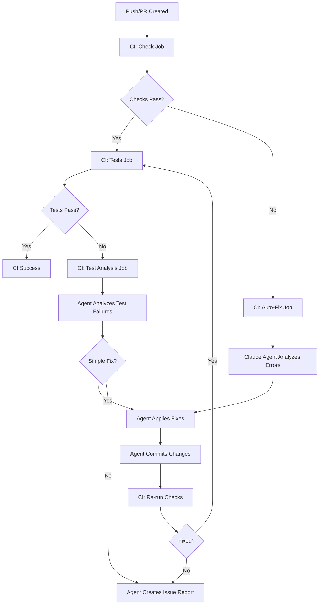

# Feature Specification: CI Agent Auto-Fix with Claude Agent SDK

**Feature Branch**: `003-ci-agent-autofix`
**Created**: 2026-01-08
**Updated**: 2026-01-08
**Status**: Draft

## Feature Vision

Integrate Claude Agent SDK into the GitHub Actions CI pipeline to automatically detect, diagnose, and fix common CI failures including linting errors, type checking issues, and test failures. This feature enables a self-healing CI/CD pipeline that reduces manual intervention and accelerates development velocity.

**Inspired by**: [cc-demo repository](https://github.com/hiimoliverwang/cc-demo) which demonstrates automated lint/type error fixes using Claude Agent SDK.

## Problem Statement

### Current Pain Points

1. **Manual Fix Cycles**: When CI fails due to lint/type errors, developers must:
   - Pull latest changes
   - Run checks locally
   - Fix issues manually
   - Commit and push
   - Wait for CI to run again

2. **Context Switching**: CI failures interrupt developer flow, requiring context switching from feature development to fix formatting/linting issues

3. **Inconsistent Fixes**: Different developers may fix the same type of error differently, leading to inconsistent code style

4. **Delayed Feedback**: Test failures require investigation, reproduction, and manual fixes, delaying the feedback loop

### Solution

Implement an AI-powered auto-fix workflow that:

- **Detects** CI failures automatically
- **Analyzes** the root cause using Claude Agent SDK
- **Applies** fixes programmatically with controlled tool access
- **Commits** corrections back to the branch
- **Validates** that fixes resolve the issues

## User Stories

### US-001: Automatic Lint Error Fixes

**As a** developer
**I want** CI to automatically fix lint errors
**So that** I don't have to manually format code or fix style issues

**Acceptance Criteria**:

- [ ] When lint checks fail in CI, auto-fix job triggers
- [ ] Agent analyzes lint errors using ruff/eslint output
- [ ] Agent applies fixes using Edit tool
- [ ] Agent commits changes with descriptive message
- [ ] Re-run of lint checks passes after auto-fix

### US-002: Type Checking Error Resolution

**As a** developer
**I want** CI to automatically resolve common type errors
**So that** I can focus on logic rather than type annotations

**Acceptance Criteria**:

- [ ] When mypy/TypeScript type checks fail, auto-fix job triggers
- [ ] Agent analyzes type errors and suggests fixes
- [ ] Agent adds type annotations or adjusts types
- [ ] Agent commits changes with explanation
- [ ] Type checks pass after auto-fix

### US-003: Test Failure Analysis and Fix

**As a** developer
**I want** CI to analyze test failures and attempt fixes
**So that** simple test issues are resolved automatically

**Acceptance Criteria**:

- [ ] When pytest/jest tests fail, analysis job triggers
- [ ] Agent reviews test output and identifies root cause
- [ ] For simple fixes (imports, syntax), agent applies corrections
- [ ] For complex issues, agent creates detailed issue report
- [ ] Agent comments on PR with findings

### US-004: Controlled Tool Access

**As a** repository administrator
**I want** the agent to have limited, controlled access to tools
**So that** security is maintained while enabling automation

**Acceptance Criteria**:

- [ ] Agent can only use Read, Edit, and specific Bash commands
- [ ] Allowed commands: npm, git, pytest, ruff, mypy
- [ ] Agent cannot execute arbitrary system commands
- [ ] All agent actions are logged and auditable
- [ ] Agent runs in isolated workflow environment

### US-005: Human Override and Review

**As a** developer
**I want** to review agent-applied fixes
**So that** I maintain code quality and correctness

**Acceptance Criteria**:

- [ ] Agent commits are clearly labeled (e.g., "fix: auto-fix lint errors [claude-agent]")
- [ ] Agent provides summary comment on PR explaining changes
- [ ] Developers can revert agent commits if needed
- [ ] Agent actions appear in PR diff for review
- [ ] Agent respects CLAUDE.md guidelines and project constitution

## System Architecture

### Workflow Integration



### Tech Stack

**CI/CD Platform:**

- GitHub Actions (existing infrastructure)

**Agent SDK:**

- Claude Agent SDK (via @anthropic-ai/sdk-agent or claude-code-action)
- Anthropic API (Claude Sonnet 4.5 model)

**Integration Method:**

- Custom GitHub Action using Claude Code Action v1.0
- Or: Direct SDK integration using Node.js/TypeScript

**Configuration:**

- `.github/workflows/ci-agent.yml` - Auto-fix workflow
- `.claude/skills/` - Custom skills for fix operations
- `.github/claude-agent-config.json` - Agent configuration

## Technical Design

### GitHub Actions Workflow Structure

Based on [cc-demo pattern](https://github.com/hiimoliverwang/cc-demo/blob/main/.github/workflows/ci.yml):

```yaml
# .github/workflows/ci.yml (enhanced)
name: CI with Auto-Fix

on:
  push:
    branches: [main, "claude/**"]
  pull_request:
    branches: [main]

jobs:
  # Job 1: Run quality checks
  check:
    name: Code Quality Checks
    runs-on: ubuntu-latest
    outputs:
      lint-failed: ${{ steps.lint.outcome == 'failure' }}
      type-failed: ${{ steps.type.outcome == 'failure' }}
    steps:
      - uses: actions/checkout@v4

      # Backend checks
      - name: Backend Lint
        id: backend-lint
        run: cd backend && ruff check .
        continue-on-error: true

      - name: Backend Type Check
        id: backend-type
        run: cd backend && mypy src
        continue-on-error: true

      # Frontend checks
      - name: Frontend Lint
        id: frontend-lint
        run: cd frontend && npm run lint
        continue-on-error: true

      - name: Frontend Type Check
        id: frontend-type
        run: cd frontend && npm run type-check
        continue-on-error: true

  # Job 2: Auto-fix failures
  auto-fix:
    name: Auto-Fix CI Errors
    needs: check
    if: failure()
    runs-on: ubuntu-latest
    permissions:
      contents: write
      pull-requests: write
    steps:
      - uses: actions/checkout@v4
        with:
          fetch-depth: 0
          token: ${{ secrets.GITHUB_TOKEN }}

      - name: Configure Git
        run: |
          git config user.name "claude-agent[bot]"
          git config user.email "claude-agent[bot]@users.noreply.github.com"

      - name: Run Claude Agent Auto-Fix
        uses: anthropics/claude-code-action@v1
        with:
          anthropic_api_key: ${{ secrets.ANTHROPIC_API_KEY }}
          prompt: |
            Analyze the CI failures and fix them:
            1. Run the failing checks to see current errors
            2. Fix lint errors using ruff/eslint
            3. Fix type errors by adding annotations
            4. Commit fixes with descriptive message
          allowed_tools:
            - Read
            - Edit
            - Bash(npm:*)
            - Bash(git:*)
            - Bash(ruff:*)
            - Bash(mypy:*)
            - Bash(pytest:*)
          auto_commit: true
          commit_message: "fix: auto-fix CI errors [claude-agent]"

  # Job 3: Tests (runs after successful checks)
  tests:
    name: Test Suite
    needs: check
    if: success()
    runs-on: ubuntu-latest
    steps:
      - uses: actions/checkout@v4
      - name: Run Backend Tests
        run: cd backend && pytest
      - name: Run Frontend Tests
        run: cd frontend && npm test

  # Job 4: Test failure analysis
  test-analysis:
    name: Analyze Test Failures
    needs: tests
    if: failure()
    runs-on: ubuntu-latest
    permissions:
      issues: write
      pull-requests: write
    steps:
      - uses: actions/checkout@v4

      - name: Analyze Test Failures
        uses: anthropics/claude-code-action@v1
        with:
          anthropic_api_key: ${{ secrets.ANTHROPIC_API_KEY }}
          prompt: |
            Analyze the test failures:
            1. Run the failing tests to capture output
            2. Identify root cause of failures
            3. If simple fix (imports, syntax), apply it and commit
            4. If complex issue, create detailed issue report as PR comment
          allowed_tools:
            - Read
            - Edit
            - Bash(pytest:*)
            - Bash(npm:*)
          create_issue_on_complex_failure: true
```

### Claude Skills Configuration

Create specialized skills in `.claude/skills/` directory:

#### Skill: `fix-lint-errors.md`

````markdown
---
name: fix-lint-errors
description: Fix linting errors in Python and TypeScript code
---

# Fix Lint Errors

You are tasked with fixing linting errors in the codebase.

## Steps

1. **Identify the linter**: Determine if errors are from ruff (Python) or eslint (TypeScript)

2. **Run linter to capture errors**:
   - Backend: `cd backend && ruff check . --output-format=json`
   - Frontend: `cd frontend && npm run lint -- --format=json`

3. **Analyze errors**: Group errors by type and file

4. **Apply fixes**:
   - Use `ruff check --fix` for auto-fixable Python issues
   - Use `npm run lint -- --fix` for auto-fixable TypeScript issues
   - For manual fixes, use Edit tool to correct issues

5. **Verify fixes**: Run linter again to confirm all errors are resolved

6. **Commit changes**:

   ```bash
   git add .
   git commit -m "fix: resolve lint errors [claude-agent]

   - Fixed ruff errors: E501, F401, etc.
   - Fixed eslint errors: @typescript-eslint/no-unused-vars
   - Auto-applied formatting"
   ```
````

## Constraints

- Only fix lint and formatting issues
- Do NOT change logic or functionality
- Do NOT modify test files unless lint errors exist there
- Respect existing code style and patterns

````

#### Skill: `fix-type-errors.md`

```markdown
---
name: fix-type-errors
description: Fix type checking errors in Python (mypy) and TypeScript
---

# Fix Type Errors

You are tasked with fixing type checking errors.

## Steps

1. **Run type checkers**:
   - Backend: `cd backend && mypy src --show-error-codes --pretty`
   - Frontend: `cd frontend && npm run type-check`

2. **Analyze errors**: Categorize by error type:
   - Missing type annotations
   - Incompatible types
   - Missing imports
   - Generic type issues

3. **Apply fixes**:
   - Add type annotations where missing
   - Fix type incompatibilities
   - Add necessary imports
   - Use proper generic types

4. **Verify fixes**: Run type checker again

5. **Commit changes**:
   ```bash
   git add .
   git commit -m "fix: resolve type errors [claude-agent]

   - Added missing type annotations
   - Fixed type incompatibilities
   - Resolved mypy/TypeScript errors"
````

## Constraints

- Prefer explicit types over `Any`
- Use proper generic types (List[str], Dict[str, int])
- Follow project type conventions (check existing code)
- Do NOT suppress errors with `# type: ignore` unless necessary

````

#### Skill: `analyze-test-failures.md`

```markdown
---
name: analyze-test-failures
description: Analyze test failures and provide detailed diagnostics
---

# Analyze Test Failures

You are tasked with analyzing test failures and determining if they can be auto-fixed.

## Steps

1. **Run failing tests**:
   - Backend: `cd backend && pytest -v --tb=short`
   - Frontend: `cd frontend && npm test -- --verbose`

2. **Capture test output**: Save full traceback and error messages

3. **Categorize failures**:
   - **Simple**: Import errors, syntax errors, missing fixtures
   - **Medium**: Logic errors in test setup, mock configuration
   - **Complex**: Business logic errors, integration issues

4. **For Simple failures**:
   - Fix imports
   - Fix syntax errors
   - Add missing fixtures
   - Commit fixes

5. **For Medium/Complex failures**:
   - Create detailed analysis report
   - Include: failing test names, error messages, suspected root cause
   - Provide suggestions for manual fixes
   - Post as PR comment or create issue

## Output Format

For complex issues, create this report:

```markdown
## Test Failure Analysis

### Summary
X tests failed across Y test files

### Failed Tests

#### backend/tests/test_foo.py::test_bar
**Error**: AssertionError: expected 42, got 43
**Root Cause**: Balance calculation logic may have rounding error
**Suggested Fix**: Review decimal precision in transaction_service.py:123

### Recommendations
1. Check decimal rounding in balance calculations
2. Verify test data setup in conftest.py
3. Review recent changes to transaction logic
````

## Constraints

- Only auto-fix simple import/syntax errors
- Do NOT change test logic or assertions
- Do NOT modify business logic to make tests pass
- Provide detailed analysis for manual review

````

### Agent Configuration

Create `.github/claude-agent-config.json`:

```json
{
  "model": "claude-sonnet-4.5-20250929",
  "allowed_tools": {
    "Read": true,
    "Edit": true,
    "Bash": {
      "allowed_commands": [
        "npm:*",
        "git:*",
        "ruff:*",
        "mypy:*",
        "pytest:*",
        "eslint:*",
        "tsc:*"
      ],
      "forbidden_commands": [
        "rm -rf",
        "chmod",
        "chown",
        "curl",
        "wget"
      ]
    }
  },
  "auto_commit": {
    "enabled": true,
    "prefix": "[claude-agent]",
    "require_approval": false
  },
  "safety_limits": {
    "max_edits_per_run": 50,
    "max_commits_per_run": 1,
    "max_execution_time": 600
  }
}
````

## Implementation Plan

### Phase 1: Basic Lint Auto-Fix (Week 1)

- [ ] Set up Claude Agent SDK in GitHub Actions
- [ ] Create auto-fix workflow for backend lint errors
- [ ] Create auto-fix workflow for frontend lint errors
- [ ] Test on sample PRs with intentional lint errors

### Phase 2: Type Checking Auto-Fix (Week 2)

- [ ] Extend workflow to handle mypy errors
- [ ] Extend workflow to handle TypeScript errors
- [ ] Create type error analysis skill
- [ ] Test on sample PRs with type errors

### Phase 3: Test Failure Analysis (Week 3)

- [ ] Create test failure analysis workflow
- [ ] Implement simple test fix automation
- [ ] Implement complex issue reporting
- [ ] Test on various test failure scenarios

### Phase 4: Integration & Refinement (Week 4)

- [ ] Integrate all workflows into unified CI pipeline
- [ ] Add PR comment notifications
- [ ] Implement safety limits and monitoring
- [ ] Document usage and best practices

## Security Considerations

### Access Control

1. **API Key Management**:
   - Store `ANTHROPIC_API_KEY` as GitHub repository secret
   - Rotate keys quarterly
   - Monitor API usage for anomalies

2. **Tool Restrictions**:
   - Whitelist specific commands only
   - No file system destructive operations
   - No network access commands
   - No privilege escalation

3. **Code Review**:
   - All agent commits require human review before merge
   - Agent cannot approve PRs
   - Agent cannot merge code

### Audit Trail

1. **Logging**:
   - Log all agent actions in workflow runs
   - Track commits by agent bot account
   - Monitor tool usage and errors

2. **Transparency**:
   - Agent commits clearly labeled
   - Agent provides explanation in commit messages
   - Agent actions visible in PR timeline

## Success Metrics

### Efficiency Metrics

- **Auto-fix Success Rate**: % of lint/type errors successfully auto-fixed
- **Time Saved**: Average time saved per PR (manual fix time - auto-fix time)
- **CI Re-run Reduction**: % reduction in manual CI re-runs

### Quality Metrics

- **Fix Correctness**: % of agent fixes that are accepted without revert
- **False Positive Rate**: % of fixes that introduce new issues
- **Coverage**: % of CI failures that agent can handle

### Target Goals (After 3 Months)

- 80% of lint errors auto-fixed successfully
- 60% of type errors auto-fixed successfully
- 30% reduction in manual CI intervention
- <5% false positive rate

## Risks and Mitigations

| Risk                         | Impact | Likelihood | Mitigation                                     |
| ---------------------------- | ------ | ---------- | ---------------------------------------------- |
| Agent introduces bugs        | High   | Medium     | Require human review, comprehensive tests      |
| API costs exceed budget      | Medium | Low        | Set usage limits, monitor costs                |
| Agent commits sensitive data | High   | Low        | Implement pre-commit secrets scanning          |
| Agent gets stuck in fix loop | Medium | Medium     | Limit max commits per run, timeout after 10min |
| Agent bypasses code review   | High   | Low        | Prevent agent from approving/merging PRs       |

## References

- [cc-demo Repository](https://github.com/hiimoliverwang/cc-demo) - Reference implementation
- [Claude Code Action](https://github.com/anthropics/claude-code-action) - Official GitHub Action
- [Claude Code GitHub Actions Docs](https://code.claude.com/docs/en/github-actions)
- [Automate Security Reviews with Claude Code](https://www.anthropic.com/news/automate-security-reviews-with-claude-code)
- [How to Integrate Claude Code with CI/CD](https://skywork.ai/blog/how-to-integrate-claude-code-ci-cd-guide-2025/)

## Appendix A: Example Workflow Run

### Scenario: Lint Error Auto-Fix

1. Developer pushes code with lint errors to PR
2. CI `check` job runs, lint fails
3. CI `auto-fix` job triggers
4. Agent analyzes ruff/eslint output
5. Agent runs `ruff check --fix` and fixes 15 errors
6. Agent manually fixes 3 remaining errors with Edit tool
7. Agent commits: "fix: resolve 18 lint errors [claude-agent]"
8. CI re-runs checks, all pass ✓
9. PR shows agent commit in timeline
10. Developer reviews changes, approves PR

### Scenario: Complex Test Failure

1. Developer's changes break 3 tests
2. CI `tests` job runs, tests fail
3. CI `test-analysis` job triggers
4. Agent analyzes test failures
5. Agent identifies: 1 simple (import error), 2 complex (logic errors)
6. Agent fixes import error and commits
7. Agent creates detailed analysis report for 2 complex failures
8. Agent posts report as PR comment
9. Developer reviews, fixes complex issues manually
10. PR updated, tests pass ✓

## Appendix B: Cost Estimation

### API Usage Estimates

**Per PR (Average)**:

- Auto-fix run: ~5,000 tokens input, ~2,000 tokens output
- Test analysis: ~8,000 tokens input, ~3,000 tokens output
- Cost: ~$0.15 per PR with Claude Sonnet 4.5

**Monthly (50 PRs)**:

- Total cost: ~$7.50/month
- ROI: 10-20 hours developer time saved @ $50/hr = $500-1000 value

### Budget Recommendations

- Start with $50/month budget
- Monitor usage first 2 weeks
- Adjust based on actual PR volume

## Appendix C: Troubleshooting Guide

### Issue: Agent fixes introduce new errors

**Solution**:

- Review agent's allowed tools - may need more restrictions
- Check if agent is following CLAUDE.md guidelines
- Improve skill instructions with more constraints

### Issue: Agent cannot fix certain error types

**Solution**:

- Create new skill for that error pattern
- Improve error parsing in workflow
- Update allowed tools if needed

### Issue: Workflow timeout

**Solution**:

- Reduce max execution time limit
- Split complex fixes into multiple commits
- Improve agent prompts to be more focused

### Issue: Cost exceeds budget

**Solution**:

- Reduce auto-fix frequency (only on certain branches)
- Use smaller model (Claude Haiku for simple fixes)
- Implement caching for repeated fixes
